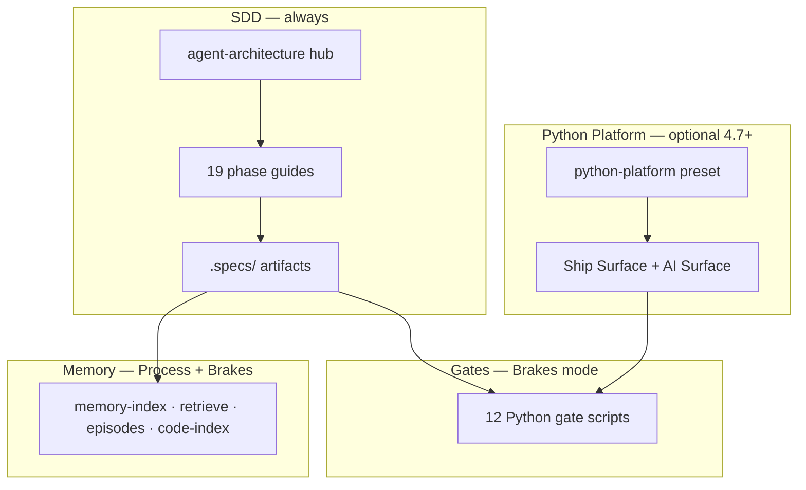

# Spec Guardrails

[](https://www.npmjs.com/package/@luizsantiago/spec-guardrails)
[](https://github.com/luizssantiago92/spec-guardrails/actions/workflows/ci.yml)
[](LICENSE)


**Governed spec-driven development for AI coding agents.**

Spec Guardrails installs a **working method** into your repository: the agent writes what it will build, gets your approval, implements in small waves, and proves the result before calling it done. Plans, decisions, and evidence live as **files in git** — not only in chat.

**What it is:** a spec-driven process kit (SDD) with optional Python **gates** that block structural shortcuts, plus **memory** that survives sessions.

**What it is not:** a live LLM observability platform, an MLOps runtime, or a Terraform security scanner. It governs **versioned contracts** in `.specs/` — see [honest limits](#honest-limits) and [ecosystem map](docs/guide/ecosystem.md).

npm: [`@luizsantiago/spec-guardrails`](https://www.npmjs.com/package/@luizsantiago/spec-guardrails) **4.7.x**

---

## Who it's for

| Audience | What you get |
| --- | --- |
| **Any stack** | Default SDD — hub, phase guides, `.specs/` memory, optional Brakes gates |
| **Python platform teams** (4.7+) | Backend + DevOps + AI in one repo — preset `python-platform`, Ship/AI Surface in `design.md`, gate `validate-ship-surface` — [guide](docs/guide/python-platform.md) · [Tutorial 04](docs/guide/tutorials/04-python-platform-ship-surface.md) |
| **Brownfield repos** | `project-init` maps existing code; memory and lessons accumulate over time |

Works with **Cursor, Claude Code, Copilot, Codex**, and other agents — [platform parity](docs/guide/Platform-parity.md).

---

## What changes in practice

| Without it | With Spec Guardrails |
| --- | --- |
| The agent jumps straight to code and says "done" | Requirements are written and approved first; "done" needs evidence |
| Each new chat starts from zero | Specs, decisions, and state live in `.specs/` and survive the session |
| Small fixes and risky features get the same treatment | The agent measures complexity and applies only the depth the change needs |
| The whole playbook is pasted into every message | One phase guide is loaded per turn — lower cost, sharper focus |

You stay in charge of scope: the agent proposes; you approve specs, task plans, and anything beyond local git commits.

---

## How the kit fits together

Four layers work together. **SDD** and **memory** run on Node alone; **gates** need Python for automatic blocking; **Python Platform** is an optional preset for teams that ship infra and AI from the same repo.



---

### 1. Spec-driven development (SDD)

The agent follows a **phase map** instead of improvising: optional Explore/Elicit → Specify → (Discuss/Design) → Tasks → Execute in waves → Verify → Archive.

| You do | Agent does |
| --- | --- |
| Describe the feature or point at `prd.md` / `docs/brief.md` | Classify complexity (Quick → Parallel) and load **one** phase guide per turn |
| Approve `spec.md`, `tasks.md`, and design when used | Write artifacts under `.specs/features/NNN-slug/` |
| Approve push/PR when ready (git tiers) | Run gates at boundaries; commit `.specs/` with code |


Requirements analysis (`/elicit`) is **suggested** when the request is vague — not forced when your brief is already clear.

**Go deeper:** [Overview](docs/guide/Overview.md) · [How it works](docs/guide/How-it-works.md) · [Agent commands](docs/guide/agent-commands.md) · [Concepts](docs/guide/concepts.md) · [Requirements analysis](docs/guide/requirements-analysis.md)

---

### 2. Gates (Brakes mode)

**Gates** are Python scripts the agent runs at phase boundaries. **Exit code ≠ 0 means STOP** — fix the artifact, re-run.

| Mode | Runtime | Enforcement |
| --- | --- | --- |
| **Process** | Node 18+ | Same workflow; agent follows checklists in skills |
| **Brakes** | Node + **Python 3.10+** | Structural gates **block** incomplete specs, tasks, traceability, and evidence |

Python turns "trust the agent" into "the agent has to prove it." Run `doctor` to see Process vs Brakes scores.

| Gate | Stops the agent when… |
| --- | --- |
| `validate-req-analysis` | Requirements brief has open questions or no owner approval |
| `validate-spec` | Spec has no testable `SHALL`/`MUST` acceptance criteria |
| `analyze-artifacts` | A requirement has no matching task |
| `validate-tasks` | Tasks are vague, overlap files, or break graph rules |
| `validate-traceability` | REQ → task → proof chain is broken |
| `validate-ship-surface` | Infra/AI paths in tasks but Ship/AI Surface missing in `design.md` *(python-platform teams)* |
| `validate-state` | Feature declared done without PASS verdict and `file:line` evidence |
| `validate-quick` | Quick-mode change broke size or shape rules |
| `check-commit` | Commit message not conventional, empty staged diff, or over `commit.max_staged_lines` |
| `check-suppressions` | Staged diff adds `# noqa`, `eslint-disable`, `@ts-ignore`, skipped tests, or `--no-verify` |
| `quality-checks` | Configured project commands (`pytest`, `npm test`, …) fail during `/verify` |
| `lessons` | A failed verify tries to skip recording the lesson |

**Go deeper:** [Gates reference](docs/guide/gates.md) · [Guarantees matrix](docs/guide/Guarantees-matrix.md) · [Gates and guarantees](docs/guide/Gates-and-guarantees.md)

---

### 3. Memory

Everything important lives under **`.specs/`** — authoritative over chat history.

| Piece | Role |
| --- | --- |
| `STATE.md` | Active feature, phase, single next step |
| `features/NNN-slug/` | Spec, tasks, design, validation per feature |
| `project/PROJECT.md` | Long-lived repo map (brownfield) |
| `domains/<slug>/spec.md` | Consolidated knowledge after archive |
| `lessons.json` | Rules learned from verify failures |

**CLI helpers** (optional power tools): `memory-index`, `memory-search`, `memory-query`, `memory-retrieve`, `episodes`, `code-index` — so a new session can ask *"what did we decide about session timeout?"* without you re-explaining.

Semantic search is **off by default**; enable after `memory-index embed` when the team wants it.

**Go deeper:** [Memory](docs/guide/Memory.md) · [Brownfield context](docs/guide/brownfield-context.md) · [Architecture](docs/guide/Architecture.md)

---

### 4. Python Platform (optional — 4.7+)

For teams shipping **Python backend + DevOps + AI** from one repository — without becoming LangSmith or a deploy platform.

| Piece | What it does |
| --- | --- |
| **`python-platform` preset** | Extends `python` with pytest/ruff hints, elicitation paths, suggested `quality.checks`, ship/AI globs |
| **Ship Surface** (`design.md`) | Deploy unit, CI, rollback — required when task `Files` touch Docker, Terraform, Helm, CI workflows |
| **AI Surface** (`design.md`) | Eval harness, fallback, model scope — required when tasks touch `prompts/`, `evals/`, MCP, RAG paths |
| **`validate-ship-surface`** | Structural gate only — fields must exist; does not run `terraform plan` or live LLM eval |
| **`python-devops.md` / `ai-engineering.md`** | Sister skills loaded on demand for infra or AI work |
| **`feature-overview`** | Dashboard adds operational + AI traceability tables from `design.md` |

```bash
npx @luizsantiago/spec-guardrails install
npx @luizsantiago/spec-guardrails init-config --preset python-platform
```

**Honest limits:** no production LLM traces; eval quality is your team's job; IaC checks are structural (`terraform validate`, `helm template`), not plan review.

**Go deeper:** [Python platform guide](docs/guide/python-platform.md) · [Tutorial 04](docs/guide/tutorials/04-python-platform-ship-surface.md) · [Ecosystem — adjacent tools](docs/guide/ecosystem.md) · [Product history — version pinning](docs/guide/Product-history.md)

---

## Ecosystem position

| Layer | Examples | Spec Guardrails |
| --- | --- | --- |
| Runtime / observability | LangSmith, Coze Loop | **Adjacent** — we version git contracts, not live traces |
| Official SDD CLI | GitHub Spec Kit | **Same problem space** — we add Brakes gates and `.specs/` memory |
| Harness loops | loopgate_harness, loop-engineering | **Complementary** — wave execution + enforcement ideas |
| **This package** | `@luizsantiago/spec-guardrails` | Skills + `.specs/` + Python gates + platform adapters |

Full map: [ecosystem.md](docs/guide/ecosystem.md)

---

## Install

Run once in your project root:

```bash
npx @luizsantiago/spec-guardrails install
npx @luizsantiago/spec-guardrails doctor
```

`install` writes phase guides for your agent and creates `.specs/`. By default it detects your platform (Cursor, Claude Code, Copilot, or Codex) and installs **one** skill tree. Use `install --all-platforms` for every tree, or `install --platform <id>` to force one.

Re-run `install` after upgrading — existing `.specs/` notes are preserved. Day to day you work in **agent chat**; the agent calls the CLI and gates.

| Requirement | Role |
| --- | --- |
| **Node.js 18+** | Required — CLI and install |
| **Python 3.10+** | Optional — enables Brakes (automatic gates) |

**Go deeper:** [Quick start](docs/guide/Quick-start.md) · [CHANGELOG](docs/CHANGELOG.md) · [Migration](docs/guide/Migration.md) · [Tutorials](docs/guide/tutorials/README.md)

---

## How it sizes the work

Before starting, the agent classifies the change. A typo does not get a task graph; a payments integration does not skip review.


| Complexity | Typical scope | What gets created | Your approvals |
| --- | --- | --- | --- |
| **Quick** | ≤3 files, no new dependency, no auth/payments | Code + quick evidence | None (express lane) |
| **Simple** | Small localized change, 2–5 files | `spec.md` → code → `validation.md` | Spec |
| **Medium** | Real feature, under ~10 jobs | `spec.md`, `tasks.md` → code → `validation.md` → archive | Spec + tasks |
| **Complex** | New APIs, architecture, infrastructure | Above + `design.md`, option discussion | Spec + tasks (+ design when used) |
| **Parallel** | Work safely splittable across agents | Above + `task-graph.md` | Spec + tasks |

Implementation runs in **small waves** — pick runnable jobs, test, implement, gate, commit, repeat. Parallel work only when jobs touch disjoint files.

**Go deeper:** [Complexity tiers](docs/guide/concepts.md#complexity-tiers--how-the-agent-chooses-depth) · [Loop patterns](docs/guide/loop-patterns.md) · [Token efficiency](docs/guide/Token-efficiency.md)

---

## Kit inventory

| Category | Count | Contents |
| --- | ---: | --- |
| **Artifacts** | 12 | `STATE.md`, `requirements-brief.md`, `spec.md`, `exploration.md`, `design.md`, `tasks.md`, `task-graph.md`, `validation.md`, `PROJECT.md`, `ROADMAP.md`, domain specs, `lessons.json` |
| **Phase guides** | 19 | `references/` — specify, tasks, implement, validate, … |
| **Sister skills** | 10 | `engineering-standards`, `task-graph-engineering`, `security-review`, `git-handoff`, `appsec`, `qa-strategy`, `code-simplify`, `ship-ready`, `python-devops`, `ai-engineering` |
| **Hub** | 1 | `agent-architecture.md` — router, contract, gate schedule |
| **Gates** | 12 | Python scripts in `.specs/guardrails/scripts/` (see [Gates](#2-gates-brakes-mode)) |
| **Memory CLI** | 6 | index, search, query, retrieve, episodes, code-index |
| **Config presets** | 4+ | `default`, `node-ts`, `python`, `python-platform`, … — `preset list` |

Skills load **one at a time** (hub → one reference → optional sister) to keep sessions affordable.

**Go deeper:** [Skills and hub](docs/guide/skills-and-hub.md)

---

## What lands in your repository

| Path | Role |
| --- | --- |
| `.cursor/skills/` (or detected platform tree) | Hub, sisters, and phase guides |
| `.specs/STATE.md` | Active feature and next step |
| `.specs/features/NNN-slug/` | Spec, tasks, and validation per feature |
| `.specs/guardrails/scripts/` | Python gate scripts (Brakes mode) |
| `.specs/config.yaml` | Optional presets, rules, execution policy, ship/AI globs |

---

## Honest limits

Gates enforce **structure and evidence in `.specs/`** — not product taste, not whether your tests are clever, and not a full AST review of implementation code.

| Gates check | Gates do **not** check |
| --- | --- |
| Spec sections and `SHALL`/`MUST` criteria | Semantic alignment between tests and requirements |
| REQ → task → validation traceability | Stub or broken source outside cited paths |
| Ship/AI Surface fields when infra/AI paths apply | `terraform plan` safety, rollback tested in prod, eval quality |
| Commit shape and suppression patterns | Whether coverage % equals test quality |
| Commands under `quality.checks` | Commands you never configured |

A green gate means the artifact shape and cited proof look complete — you still approve specs and tasks.

**Go deeper:** [Guarantees matrix](docs/guide/Guarantees-matrix.md) · [FAQ](docs/guide/FAQ.md)

---

## Documentation

| Topic | Start here | Go deeper |
| --- | --- | --- |
| Orientation | [Overview](docs/guide/Overview.md) | [Concepts](docs/guide/concepts.md) |
| First session | [Quick start](docs/guide/Quick-start.md) | [Agent commands](docs/guide/agent-commands.md) |
| Process model | [How it works](docs/guide/How-it-works.md) | [Loop patterns](docs/guide/loop-patterns.md) |
| Enforcement | [Gates](docs/guide/gates.md) | [Gates and guarantees](docs/guide/Gates-and-guarantees.md) |
| Python platform | [python-platform.md](docs/guide/python-platform.md) | [Tutorial 04](docs/guide/tutorials/04-python-platform-ship-surface.md) |
| Requirements | [Requirements analysis](docs/guide/requirements-analysis.md) | [/elicit in agent commands](docs/guide/agent-commands.md) |
| Long-running projects | [Memory](docs/guide/Memory.md) | [Brownfield context](docs/guide/brownfield-context.md) |
| Ecosystem | [ecosystem.md](docs/guide/ecosystem.md) | [Product history](docs/guide/Product-history.md) |
| Questions | [FAQ](docs/guide/FAQ.md) | [Glossary](docs/guide/Glossary.md) · [Stability policy](docs/guide/Stability-policy.md) |

Full index: [docs/guide/README.md](docs/guide/README.md)

---

## Contributing

Focused improvements are welcome — see [CONTRIBUTING.md](CONTRIBUTING.md) for layout, gate stability rules, and local checks.

Edit sources under `skills/`, `lib/`, `scripts/`, and `rules/`; re-run `npm run guardrails -- install` after changing shipped assets, and run `npm test` before every PR.

---

## Credits

Spec Guardrails adapts patterns from open-source work. These are the projects whose ideas are actually shipped in the package:

| Project | License | Used for |
| --- | --- | --- |
| [tlc-spec-driven](https://github.com/tech-leads-club/agent-skills/tree/main/packages/skills-catalog/skills/(development)/tlc-spec-driven) | CC-BY-4.0 | Spec → tasks → execute → verify model, `.specs/` layout, gate philosophy |
| [addyosmani/agent-skills](https://github.com/addyosmani/agent-skills) | MIT | Design-discussion patterns and definition-of-done framing |
| [graph-engineering](https://github.com/codejunkie99/graph-engineering) | MIT | Task-graph rules behind safe parallel waves |
| [loop-engineering](https://github.com/cobusgreyling/loop-engineering) | MIT | Wave-based execution model |
| [loopgate_harness](https://github.com/rxdt/loopgate_harness) | MIT | Suppression-bypass blocking, project-configured quality commands as verify evidence, honest-limits framing, and README diagram layout (proxy-safe SVG; SMIL animation on GitHub) |

Everything else — the CLI, the Python checks, the platform adapters, the requirements-analysis phase, and the **Python Platform pack (4.7+)** — is original work in this repository. Full lineage: [Credits and lineage](docs/guide/credits.md).

---

## License

MIT — see [LICENSE](LICENSE).
