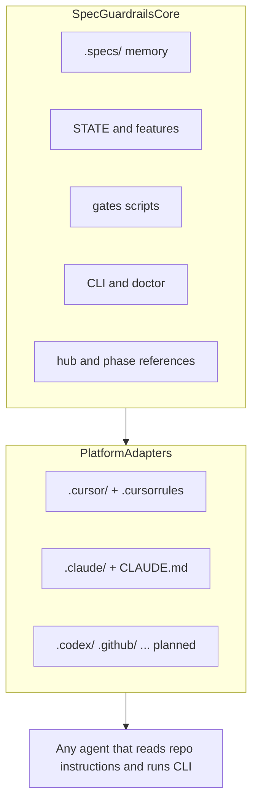

# Architecture — Core and platform adapters

Spec Guardrails is **agent-agnostic at the core**. Any agent that can read repo instructions, edit files, and run shell commands can use the same loop, memory, and (with Python) structural gates.

Platform-specific folders are **adapters** — where skills and always-on rules land for each product. Today: Cursor and Claude Code. More adapters can ship later without changing the core contract.

## Diagram

## Core (shared, agent-agnostic)

| Piece | Location / entry | Role |
| --- | --- | --- |
| Project memory | `.specs/` (`STATE.md`, `features/`, domains, lessons) | Survives chats; source of truth for plans and status |
| Structural gates | `.specs/guardrails/scripts/*.py` | Brakes mode — exit ≠ 0 when paperwork fails |
| CLI | `npx @luizsantiago/spec-guardrails …` | install, doctor, gate commands, archive, feature-init |
| Hub + phases | Packaged under `skills/`; copied to adapter trees on install | One phase guide per turn; complexity router |
| Guarantees | [Guarantees matrix](Guarantees-matrix.md) | Product promises → mechanisms |
| Task graph rules | `task-graph.md` artifact + `validate-tasks` | Safe parallelism when 3+ tasks |

The core does **not** depend on Cursor or Claude APIs. It depends on **your repo** and optional Python for Brakes.

## Adapters (platform-specific)

Install copies the **same** hub, references, and sister skills into each adapter tree. Only always-on entry files differ.

| Adapter | Skills | Always-on contract | Status |
| --- | --- | --- | --- |
| **Cursor** | `.cursor/skills/` | `.cursorrules` + `.cursor/rules/engineering-baseline.mdc` | Shipped |
| **Claude Code** | `.claude/skills/` | `.claude/CLAUDE.md` | Shipped |
| **Codex / GitHub / others** | TBD paths | TBD entry doc | Planned — not in install yet |

Re-run `install` to refresh managed skill blocks. User prose outside Spec Guardrails markers is preserved.

Details for the two shipped adapters: [Platform parity](Platform-parity.md).

## What “agent-agnostic” means in practice

| Requirement | Notes |
| --- | --- |
| Read markdown skills from the repo | Adapter paths differ; content is the same |
| Run CLI gates when Brakes mode is on | `python3` or `npx @luizsantiago/spec-guardrails validate-*` |
| Follow chat phase conventions | `/specify`, `/loop`, `/verify` are **conventions** in skills — not shell binaries |
| Keep plans under `.specs/` | Core memory — not adapter-specific |

If your agent cannot load project skills or run local commands, you can still use the **CLI and `.specs/` layout** manually; progressive loading and phase automation assume an agent that follows the hub.

## Related

- [Guarantees matrix](Guarantees-matrix.md) — what the core promises
- [Platform parity](Platform-parity.md) — Cursor vs Claude install surface today
- [Skills and hub](skills-and-hub.md) — load order and sister skills
- [Stability policy](Stability-policy.md) — semver and gate freeze
