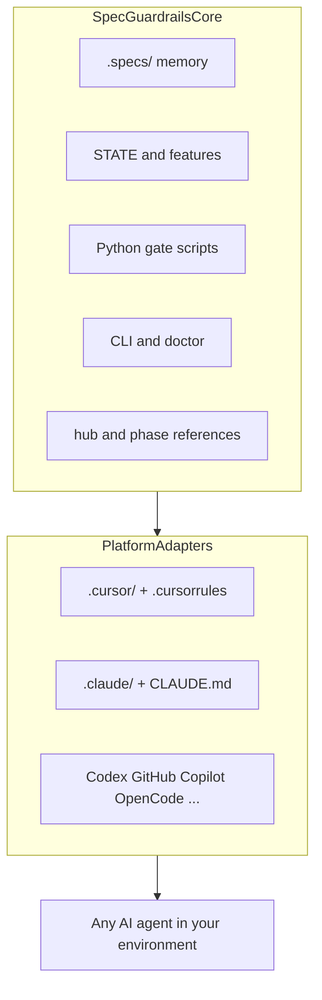

# Architecture — Core and platform adapters

Spec Guardrails is **not limited to Cursor or Claude Code**. The **core** works with any AI coding agent that can read repo instructions, edit files, and run shell commands. Platform folders are **adapters** — where the same hub, references, and sisters land for each product.

**Process mode** (Node only) and **Brakes mode** (Node + Python gates) both use this core. Gates stay **Python** — that is the full product with automated enforcement, not a gap to close later.

## Diagram

## Core (shared, every agent)

| Piece | Location / entry | Role |
| --- | --- | --- |
| Project memory | `.specs/` (`STATE.md`, `features/`, domains, lessons) | Survives chats; source of truth for plans and status |
| Structural gates | `.specs/guardrails/scripts/*.py` | **Brakes mode** — Python by design; exit ≠ 0 when paperwork fails |
| CLI | `npx @luizsantiago/spec-guardrails …` | install, doctor, gate commands, archive, feature-init |
| Hub + phases | Packaged under `skills/`; copied to adapter trees on install | One phase guide per turn; complexity router |
| Guarantees | [Guarantees matrix](Guarantees-matrix.md) | Product promises → mechanisms |
| Task graph rules | `task-graph.md` artifact + `validate-tasks` | Safe parallelism when 3+ tasks |

The core does **not** call Cursor or Claude APIs. It depends on **your repo**, Node for install/CLI, and Python when you want Brakes.

## Adapters (where skills land)

Install copies the **same** markdown into each adapter tree. Only always-on entry files differ.

| Adapter | Skills / rules | Always-on contract | Status |
| --- | --- | --- | --- |
| **Cursor** | `.cursor/skills/` | `.cursorrules` + `.cursor/rules/engineering-baseline.mdc` | **Shipped** |
| **Claude Code** | `.claude/skills/` | `.claude/CLAUDE.md` | **Shipped** |
| **OpenAI Codex** | TBD | TBD | Planned |
| **GitHub Copilot** (repo instructions) | TBD | TBD | Planned |
| **Other agents** (Windsurf, OpenCode, …) | TBD | TBD | Planned / community |

Re-run `install` to refresh managed skill blocks. User prose outside Spec Guardrails markers is preserved.

Shipped adapter details: [Platform parity](Platform-parity.md).

## Using an agent without a shipped adapter

You do not need to wait for an official adapter to get value:

1. Run `npx @luizsantiago/spec-guardrails install` — you still get `.specs/`, Python gates, and at least the shipped adapter trees.
2. Point your agent at the **hub** (`agent-architecture.md`) and phase files under `skills/references/` (paths may differ per product — copy or symlink if needed).
3. Use the **CLI** for gates in Brakes mode: `npx @luizsantiago/spec-guardrails validate-spec …`
4. Follow the same chat conventions (`/specify`, `/loop`, `/verify`) — they are documented in skills, not shell binaries.

Contributing a new adapter = new install targets in `lib/install.js` + docs — core and gates unchanged.

## Operating modes (same core, different enforcement)

| Mode | Runtime | Enforcement |
| --- | --- | --- |
| **Process** | Node | Workflow + `.specs/` + verify skill — flexible |
| **Brakes** | Node + Python | Process **plus** [Guarantees matrix](Guarantees-matrix.md) via Python gates |

## Related

- [Guarantees matrix](Guarantees-matrix.md) — what Brakes enforce
- [Platform parity](Platform-parity.md) — Cursor vs Claude install surface today
- [Skills and hub](skills-and-hub.md) — load order and sister skills
- [Stability policy](Stability-policy.md) — semver and gate freeze
