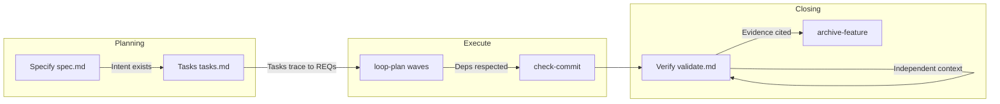

# Guarantees matrix

**Who this is for:** anyone who wants the **product view** — what Spec Guardrails promises, and **how** each promise is enforced.

Commands are implementation. **Guarantees** are the product. See [gates.md](gates.md) for script names, arguments, and pipeline order. See [Gates and guarantees](Gates-and-guarantees.md) for the maintainer freeze policy and [ADR 0001](../adr/0001-harness-freeze-v0.7.md) for Brakes contract changes.

## Operating modes

Two modes, one package:

| Mode | Runtime | What you get | Best for |
| --- | --- | --- | --- |
| **Process** | Node.js 18+ | Spec-driven workflow, `.specs/` memory, progressive skill loading, independent `/verify` (phase skill — not exit-code) | Flexible ceremony — same loop, lighter enforcement |
| **Brakes** | Node + **Python 3.10+** | Everything in Process **plus** exit-code enforcement on the rows marked *Brakes* below | **Full Spec Guardrails** — Python gates enforce the guarantees automatically |

**Gates stay Python.** Brakes mode is the complete product: structural gates that block incomplete specs, tasks, and evidence. Process mode is intentionally flexible — not a broken install.

Run `npx @luizsantiago/spec-guardrails doctor` to see whether Brakes (Python) are available.

## Matrix

| Guarantee | Mechanism | Mode | Enforcement |
| --- | --- | --- | --- |
| Intent exists before code | `validate-spec` | Brakes | Hard gate (Python) |
| Tasks derive from requirements | `analyze-artifacts` | Brakes | Hard gate |
| Requirements stay traceable | `validate-traceability` | Brakes | Hard gate |
| Task shape is buildable | `validate-tasks` | Brakes | Hard gate |
| Dependencies respected in Execute | `loop-plan` | Brakes | Hard gate |
| Parallel work is file-safe | `task-graph.md` + graph rules in `validate-tasks` | Process + Brakes | Artifact (skill) + gate (overlap / cycles) |
| Parallel work uses isolated trees | `workspace-prepare` / `workspace-cleanup` | Process | CLI + skill protocol (git worktrees) |
| Execution stays within bounds | `execution-policy` + `.specs/config.yaml` | Process | CLI (budget, scope, retries, intent/effect) |
| Contextual guards at edit/complete | `context-guard` | Process | CLI (STATE, tasks, scope, validation) |
| Solution exploration (explicit fork) | `solution-explore` | Process | CLI (candidates, comparison, decision) |
| Quick changes stay bounded | `validate-quick` | Brakes | Hard gate |
| Completion cites evidence | `validate-state` | Brakes | Hard gate |
| Commits follow policy | `check-commit` | Brakes | Hard gate |
| Verification is independent | fresh-context `/verify` + `validate.md` | Process | Phase skill (not exit-code) |
| Knowledge survives chats | `.specs/` + `archive-feature` | Process | Install + CLI |
| Failures become reusable rules | `lessons` | Brakes | Hard gate (post-verify FAIL) |

**Brakes rows** follow the frozen contract in [ADR 0001](../adr/0001-harness-freeze-v0.7.md). Loosening them requires a major and an explicit ADR — not a docs tweak.

## Phase flow (guarantees at boundaries)

Guarantees on the arrows map to mechanisms in the table — e.g. `validate-spec` before Tasks approval, `validate-traceability` after tasks and again with `validation.md`, `validate-state` before archive.

## What the matrix does **not** guarantee

These stay in **guides** (judgment and authoring quality), not in exit codes:

| Topic | Why it is out of scope |
| --- | --- |
| Semantic test ↔ REQ alignment | Gates check `file:line` citations in markdown, not whether the test asserts the criterion |
| Stub or broken source code | Gates read `.specs/` artifacts, not your implementation AST |
| Conversation depth before coding | Process habit — skills teach it; no chat checksum |
| Perfect task graphs | Templates + guidance; not a full dependency engine |
| Product taste and security nuance | Humans and conditional sisters (AppSec, QA) still matter |

**Rule of thumb:** if it is not in the matrix (or the Brakes freeze), do not promise users that Spec Guardrails “guarantees” it.

## Adversarial matrix (maintainers)

Brakes behavior is locked by CI: closed false-pass families in `test/test_adversarial_gates.py` and related suites must stay red-then-green forever. Details: [Gates and guarantees → Adversarial matrix](Gates-and-guarantees.md#adversarial-matrix) · [CONTRIBUTING](../../CONTRIBUTING.md).

## Related

- [Architecture](Architecture.md) — Core vs platform adapters
- [How it works](How-it-works.md) — narrative from goal → done
- [gates.md](gates.md) — command reference
- [FAQ](FAQ.md) — Process vs Brakes, Python, agent-agnostic core
