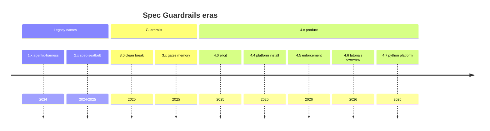

# Product history and version eras

How Spec Guardrails evolved, which releases are stable for which goals, and how to **pin a version** that fits your team.

**Detailed release notes:** [CHANGELOG](../CHANGELOG.md) (every version).  
**Upgrade steps:** [Migration](Migration.md).  
**SemVer rules:** [Stability policy](Stability-policy.md).

---

## Final product name (frozen)

**Spec Guardrails** — npm `@luizsantiago/spec-guardrails`, CLI `spec-guardrails`.  
No further package renames. Older names exist only in history below.

---

## Eras (high level)

| Era | Versions | Brand / package | What changed for users |
| --- | --- | --- | --- |
| **Harness** | 1.x | `@luizsantiago/agentic-harness` | First SDD kit; scripts under `.specs/harness/` |
| **Seatbelt** | 2.0–2.2 | `@luizsantiago/spec-seatbelt` | Rename + path moves (`.specs/seatbelt/`) |
| **Guardrails foundation** | **3.0–3.9** | `@luizsantiago/spec-guardrails` | **Clean break** — `.specs/guardrails/scripts/` only; hub, gates, memory, brownfield |
| **Elicitation** | **4.0–4.1** | same | `/elicit`, `req-analysis`, `validate-req-analysis` |
| **Install & IDE** | **4.2–4.3** | same | Cursor hooks opt-in (4.2) → **removed** (4.3); use `context-guard` + `sandbox` CLI |
| **Platform install** | **4.4** | same | One agent tree by default; `--all-platforms` / `--platform` |
| **Enforcement hardening** | **4.5** | same | `check-suppressions`, `quality-checks`, staged commit limits, README honesty |
| **Onboarding & visibility** | **4.6** | same | Tutorials 01–03, `feature-overview`, batch review docs |
| **Python platform** | **4.7+** | same | `python-platform` preset, Ship/AI Surface, `validate-ship-surface` |



---

## Choosing a version (honest guide)

There is no single “best” version — pick by **what you need** and **how much change you tolerate**.

| Your goal | Suggested pin | Why |
| --- | --- | --- |
| **New project, general SDD** | Latest **4.7.x** (or current npm) | Full hub, gates, tutorials, optional python-platform |
| **Python backend + DevOps + AI** | **4.7.0+** with `python-platform` preset | Ship/AI Surface + `validate-ship-surface` — see [python-platform.md](python-platform.md) |
| **Stable SDD without platform pack** | **4.6.0** | Mature tutorials + `feature-overview`; no Ship/AI gate surface |
| **Minimal moving parts, proven gates** | **4.5.2** | Suppressions + quality-checks + config fixes; pre-tutorial wave |
| **Multi-agent repo (Cursor + Claude + …)** | **4.4.0+** | Platform-aware `install` — see [Migration → 4.4](Migration.md#upgrading-to-44-platform-aware-install) |
| **Still on spec-seatbelt / harness** | Migrate to **3.0+** first | No dual-path — [Migration](Migration.md) |

**Bleeding edge:** `npx @luizsantiago/spec-guardrails@latest` — newest features; read [CHANGELOG](../CHANGELOG.md) before upgrading production repos.

**Conservative:** Pin an **exact** version (see below) and upgrade only after reading the changelog section for each minor.

### What “stable” means here

| Stable for… | Meaning |
| --- | --- |
| **npm install** | Version published from `main` after green CI; semver policy in [Stability policy](Stability-policy.md) |
| **Your repo** | You ran `install` once; re-run `install` after bumping the package to refresh skills/gates |
| **Gates** | Exit codes and structural checks are covered by tests; we do not loosen adversarial tests to ship |
| **Not guaranteed** | Skill prose may gain detail in minors; new optional gates do not break old workflows |

We do **not** maintain separate LTS branches today — stability is **semver + changelog + pin**. If you need long freeze, pin a minor and skip upgrades until you review [CHANGELOG](../CHANGELOG.md).

---

## How to pin a version

### One-off CLI (no package.json change)

```bash
npx @luizsantiago/spec-guardrails@4.6.0 install
npx @luizsantiago/spec-guardrails@4.6.0 doctor
```

Replace `4.6.0` with the version you chose from the table above.

### Project devDependency (recommended for teams)

```json
{
  "devDependencies": {
    "@luizsantiago/spec-guardrails": "4.7.0"
  },
  "scripts": {
    "guardrails": "spec-guardrails"
  }
}
```

Use an **exact** version (no `^`) if you want lockstep control. Bump intentionally after reading the changelog.

```bash
npm install
npm run guardrails -- install
npm run guardrails -- doctor
```

### CI

Pin the same version in CI as local dev:

```bash
npx @luizsantiago/spec-guardrails@4.7.0 doctor
```

---

## Upgrade path (summary)

| From | To | Read first |
| --- | --- | --- |
| 1.x / 2.x seatbelt | 3.0+ | [Migration](Migration.md) — fresh install |
| 4.1.x | 4.2+ | Hooks opt-in (historical) |
| 4.2.x | 4.3+ | [Hooks removed](Migration.md#upgrading-to-43-cursor-hooks-removed) |
| 4.3.x | 4.4+ | [Platform install](Migration.md#upgrading-to-44-platform-aware-install) |
| 4.6.x | 4.7+ | [python-platform.md](python-platform.md) + CHANGELOG 4.7.0 |

After any bump: `install` → `doctor` → spot-check one gate (`validate-spec` or `validate-ship-surface` if you use platform pack).

---

## Where to look for what changed

| Document | Contents |
| --- | --- |
| [CHANGELOG](../CHANGELOG.md) | Every release — **source of truth** for features, fixes, limitations |
| [Product history](Product-history.md) | Eras + version pick guide (this page) |
| [Migration](Migration.md) | Breaking steps between major eras and selected minors |
| [Stability policy](Stability-policy.md) | SemVer, gate freeze, name freeze |
| [Gates and guarantees](Gates-and-guarantees.md) | What gates promise and do not promise |

---

## Maintainer note

When shipping a new **stable** minor or patch, update:

1. [CHANGELOG](../CHANGELOG.md) — new `## x.y.z` section (include **Limitations** when relevant)
2. This page — era table or “Choosing a version” if the recommendation shifts
3. [Migration](Migration.md) — only when users must take action

Back to [Documentation index](README.md)
