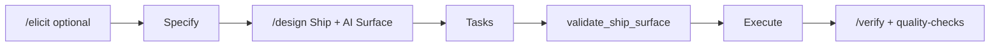

# Python platform guide

Spec Guardrails **4.7** adds a preset and gates for teams that ship **Python backend + DevOps + AI** from one repository — without becoming a live observability platform.

## Who it's for

- Backend engineers on Python 3.10+
- Who also maintain Compose / CI / Terraform / Helm
- And deliver LLM, RAG, agents, MCP, or offline eval harnesses

If you only need `pytest` + `ruff`, keep the `python` preset. Use **`python-platform`** when deploy and/or AI surfaces are part of normal work.

## Quick start

```bash
npx @luizsantiago/spec-guardrails install
npx @luizsantiago/spec-guardrails init-config --preset python-platform
# brownfield:
npx @luizsantiago/spec-guardrails project-init
```

`project-init` suggests `python-platform` when it detects Docker, Terraform, Helm, CI workflows, AI dependency groups, or `evals/` / `tests/eval/`.

## Capabilities

| Piece | Role |
| --- | --- |
| **`python-platform` preset** | pytest, ruff, elicitation paths, suggested `quality.checks`, ship/AI globs |
| **Ship Surface** (`design.md`) | Deploy unit, CI, rollback, observability — required when infra paths appear in tasks |
| **AI Surface** (`design.md`) | Eval harness, fallback, model/tools scope — required when AI paths appear in tasks |
| **`validate_ship_surface.py`** | Structural gate — blocks verify when surfaces are missing |
| **`python-devops.md`** | Sister skill for infra tasks (load on demand) |
| **`ai-engineering.md`** | Sister skill for LLM/RAG/MCP tasks (load on demand) |
| **`feature-overview`** | Dashboard adds operational + AI traceability tables |
| **Existing AI workflow** | `/elicit`, `memory-retrieve`, `solution-explore`, discrimination sensor, `lessons` — connected via preset hints |

## Workflow (summary)



1. **Classify** — `classify-change` may suggest `/elicit` or `ai-engineering.md` for RAG/MCP work.
2. **Design** — fill **Ship Surface** and/or **AI Surface** when tasks will touch matching paths.
3. **Tasks** — list real `Files`; run `validate_ship_surface` after `validate_tasks`.
4. **Verify** — cite test `file:line` evidence; run configured `quality.checks` (compose, terraform, eval).

Tutorial: [04 — Python platform Ship Surface](tutorials/04-python-platform-ship-surface.md)

## Limitations (honest)

| Limitation | What it means |
| --- | --- |
| **No live observability** | No LLM traces in production — governance lives in git + `/verify` |
| **Eval declared, not magical** | Gate requires a documented harness; quality of evals is your team's job |
| **IaC structural only** | `terraform validate` / `helm template` — not plan review or security audit |
| **Framework-agnostic** | FastAPI/Django/worker patterns are tutorial appendices, not first-class presets |
| **Semantic memory optional** | Off by default; enable after `memory-index embed` if you need it |
| **Brakes off** | Without Python 3.10+, gates become manual checklists — same standard, less automation |
| **Not AppSec** | PII/secrets stay in `security-review.md` |

## Comparison

See [ecosystem.md](ecosystem.md) — Spec Guardrails governs **versioned contracts**; LangSmith/Coze Loop govern **runtime traces**. They complement each other; we do not replace them.

## Troubleshooting

| Gate message | Fix |
| --- | --- |
| `Ship Surface missing` | Add `## Ship Surface` to `design.md` with Deploy unit, CI, Rollback |
| `AI Surface missing` | Add `## AI Surface` with Eval harness + Fallback / degrade |
| `gate not required` | Task `Files` do not match infra/AI globs — expected for pure app changes |
| Customize globs | Set `ship_surface.infra_globs` / `ai_globs` in `.specs/config.yaml` |

```bash
python3 .specs/guardrails/scripts/validate_ship_surface.py <feature>
npx @luizsantiago/spec-guardrails feature-overview <feature> --write
```
